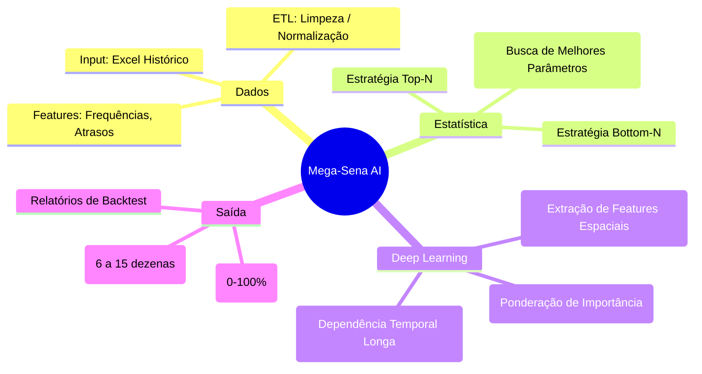

# 🎱 Mega-Sena AI: Deep Learning & Statistical Prediction


> **Um sistema avançado de previsão de números lotéricos que funde Redes Neurais Profundas (ResNet + Self-Attention + LSTM) com estratégias de Análise Estatística (Bottom/Top Frequencies).**

---

## 📑 Tabela de Conteúdos
1.  [Visão Geral](#-visão-geral-do-projeto)
2.  [Conceitos Chave](#-conceitos-chave)
3.  [Arquitetura da Solução](#-arquitetura-do-sistema)
4.  [Estrutura do Projeto](#-estrutura-de-arquivos)
5.  [Instalação e Uso](#-instalação-e-uso)
6.  [Resultados Esperados](#-resultados-e-visualizações)
7.  [Disclaimer](#-disclaimer)

---

## 📖 Visão Geral do Projeto

Este repositório contém uma suite completa de ferramentas para análise e predição de jogos da Mega-Sena. Diferente de geradores aleatórios ("surpresinha"), este sistema utiliza dados históricos para identificar padrões de comportamento dos números através de duas abordagens distintas e complementares:

1.  **Abordagem Estatística (Determinística)**: Análise de frequência ("Números Quentes/Frios") em janelas deslizantes otimizadas.
2.  **Abordagem de Deep Learning (Probabilística)**: Uma rede neural híbrida que aprende a sequência temporal e correlações complexas entre os números sorteados.

### 🧠 Mapa Mental do Sistema



---

## 🔬 Conceitos Chave

### 1. Estratégia "Bottom N" (Retorno à Média)
Baseia-se no princípio estatístico de que, em um sorteio justo, todos os números devem ter frequências similares no longo prazo.
*   **A lógica**: Se o número `42` não sai há 50 jogos e sua frequência está muito abaixo da média teórica, a probabilidade dele sair em breve para "compensar" aumenta estatisticamente.
*   **O Algoritmo**: O sistema varre janelas de 10 a 2000 jogos anteriores para encontrar qual tamanho de janela oferece a maior taxa de acerto histórica para essa estratégia.

### 2. Deep Learning Híbrido
Redes Neurais convencionais falham em loterias por tratarem os dados como ruído puro. Nossa arquitetura tenta mitigar isso combinando três tecnologias:
*   **ResNet (Residual Networks)**: Permite redes mais profundas sem perda de sinal, ajudando a identificar padrões sutis entre grupos de números.
*   **Multi-Head Attention**: Mecanismo usado em Transformers (como GPT). Ele permite que o modelo olhe para os últimos 60 jogos e decida quais foram "mais importantes" para o contexto atual, ignorando ruídos.
*   **LSTM**: Processa a sequência cronologicamente, entendendo que o jogo `T` influencia o `T+1`.

---

## 🛠️ Arquitetura do Sistema

### Pipeline de Processamento
```mermaid
graph TD
    A[📂 Base de Dados (Excel)] -->|Pandas| B(🔍 Pré-processamento)
    
    subgraph Engenharia de Features
        B -->|Cálculo| C[Frequências (60 dim)]
        B -->|Deslizamento| D[Janela Temporal (Seq 10)]
    end
    
    C & D --> E[Separação Treino/Teste]
    E -->|Arrays Numpy| F[💾 Cache (.npy)]
    
    subgraph Modelagem IA
        F --> G[🧠 Modelo Híbrido]
        G --> H{Métricas}
        H -->|Loss| I[Adam Optimizer]
        H -->|Accuracy| J[Matriz de Confusão]
    end
    
    style A fill:#f9f,stroke:#333
    style G fill:#bbf,stroke:#333
```

### Detalhe da Rede Neural (`train_model_v2_resnet.ipynb`)

```mermaid
graph LR
    Input((Entrada)) -->|Shape: (10, 60)| Conv1[Conv1D + Batch Norm]
    Conv1 --> ResBlock1[ResNet Block x3]
    ResBlock1 --> Att[Multi-Head Attention (8 heads)]
    
    Att -->|Context Vector| LSTM1[LSTM (128 units)]
    LSTM1 --> Dropout[Dropout 0.3]
    Dropout --> Dense1[Dense 256 + ReLU]
    Dense1 --> Output((Softmax Output 60))
    
    style Att fill:#ff9,stroke:#333
    style LSTM1 fill:#9f9,stroke:#333
```

---

## 📂 Estrutura de Arquivos

```text
📁 mega_sena/
├── 📂 checkpoints/             # Pesos salvos do modelo treinado (.keras)
├── 📄 Mega-Sena.xlsx           # Base de dados oficial da Caixa
├── 📄 README.md                # Este arquivo
├── 📄 requirements.txt         # Dependências do Python
│
├── 🧠 Treinamento e IA
│   ├── prepare_data_simple.ipynb     # 1. Prepara os dados (Gera .npy)
│   ├── train_model_v2_resnet.ipynb   # 2. Treina a Rede Neural
│   └── predict_with_model.py         # 3. Usa o modelo para prever
│
├── 📊 Análise Estatística
│   ├── analise_bottom_frequencias.py # Algoritmo Bottom-N (Principal)
│   ├── analise_comparativa_metodos_v3.ipynb # Comparativo visual de métodos
│   └── gerador_jogos_megasena.py     # Gerador de jogos otimizados
│
└── 📈 Relatórios e Visualizações
    ├── analise_comparativa_megasena.png # Gráfico de performance
    └── heatmap_acertos_janela.png       # Mapa de calor de janelas
```

---

## 🚀 Instalação e Uso

### 1. Configuração do Ambiente
Recomenda-se usar um ambiente virtual (venv ou conda).

```bash
# Clone o repositório ou baixe os arquivos
# Crie um ambiente virtual
python -m venv venv
# Ative o ambiente (Windows)
.\venv\Scripts\activate
# Instale as dependências
pip install -r requirements.txt
```

### 2. Preparação dos Dados
Antes de qualquer análise, é necessário transformar o Excel em tensores numéricos.
Execute todas as células do notebook `prepare_data_simple.ipynb`. Isso criará arquivos `.npy` na raiz.

### 3. Rodando a IA
Para treinar um novo modelo:
```bash
jupyter notebook train_model_v2_resnet.ipynb
```
Para apenas gerar uma previsão com o modelo existente:
```bash
python predict_with_model.py
```

### 4. Rodando a Análise Estatística
Para descobrir quais números estão mais "atrasados" segundo a melhor janela histórica:
```bash
python analise_bottom_frequencias.py
```
*Saída esperada:*
> `[+] Melhores Janelas Bottom-N encontradas...`
> `[+] Sugestão de Jogo: [04, 11, 32, 45, 51, 58]`
> `[INFO] Ganho sobre o acaso: +15.4%`

---

## 📊 Resultados e Visualizações

O sistema gera automaticamente gráficos para validação das teses:

*   **Heatmaps**: Mostram quais janelas de tempo (e.x., últimos 50 vs 100 jogos) concentraram mais acertos.
*   **Curvas de Aprendizado**: Demonstram a evolução da precisão da IA ao longo das épocas.
*   **Comparativo**: Gráficos de barra comparando a "Estratégia Aleatória" vs "Estratégia Bottom-N" vs "IA".

*(Verifique os arquivos .png na raiz do projeto após rodar os scripts de análise)*

---

## ⚠️ Disclaimer e Responsabilidade

**LEIA COM ATENÇÃO:**
Este software é um projeto de estudo em **Ciência de Dados** e **Inteligência Artificial**.
1.  **Não há garantia de lucro**: Loterias são projetadas matematicamente para que a casa sempre ganhe.
2.  **Probabilidade**: Mesmo as melhores estratégias apenas aumentam a probabilidade marginalmente, não eliminam o fator sorte.
3.  **Uso**: O autor não se responsabiliza por perdas financeiras decorrentes do uso destas sugestões.

**Jogue com responsabilidade. Proibido para menores de 18 anos.**
